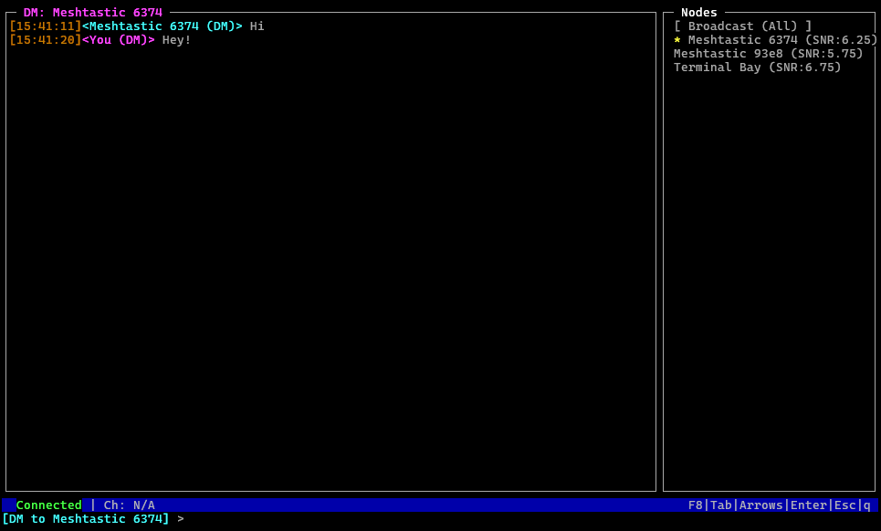

## Screenshot



# Meshtastic TUI

A cross-platform terminal user interface (TUI) for Meshtastic radios, written in Python using `prompt_toolkit`.  
Control, chat, and manage nodes on your Meshtastic mesh network. Features dynamic serial port detection, node monitoring, direct messaging, and routing diagnostics.

---

## Features

- **Real-Time Meshtastic Chat:** Send/receive broadcast and direct (DM) messages.
- **Dynamic Serial Port Selection:** Auto-detect all available serial ports, switch via TUI.
- **Node List Monitoring:** View nodes, SNR, last-heard, and select for DM or traceroute.
- **Traceroute Diagnostics:** Visualize mesh routes to any node (F5 key).
- **Message Status:** Shows delivery and error status.
- **Custom Theme/Keybinds:** Color scheme and efficient navigation.

---

## Installation

### Prerequisites

- Python 3.9+
- meshtastic-python
- prompt_toolkit
- pyserial
- pubsub

### Install dependencies

```bash
pip install prompt_toolkit pyserial meshtastic-python pubsub
or
pip install -r requirements.txt


**### Connect your Meshtastic radio via USB.**

Run the TUI:

Copy
Edit
python main.py
Select a serial port in settings mode (arrow keys + Enter).

Press F8 to switch between Settings/Chat.
