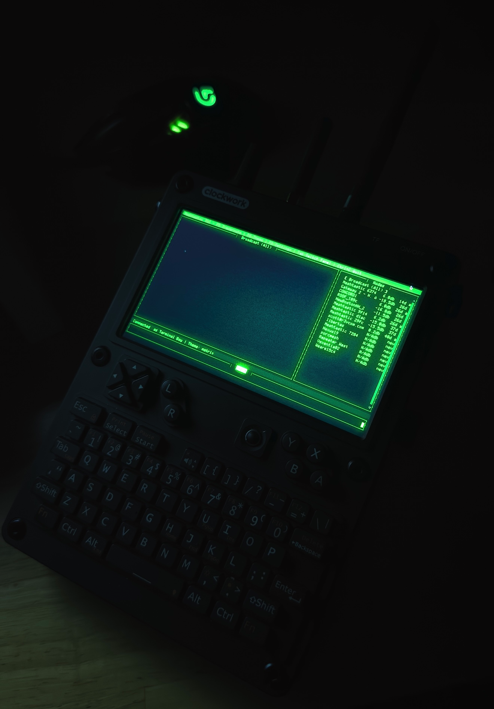
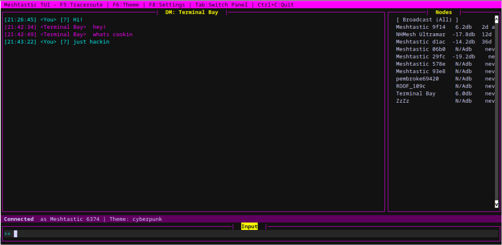
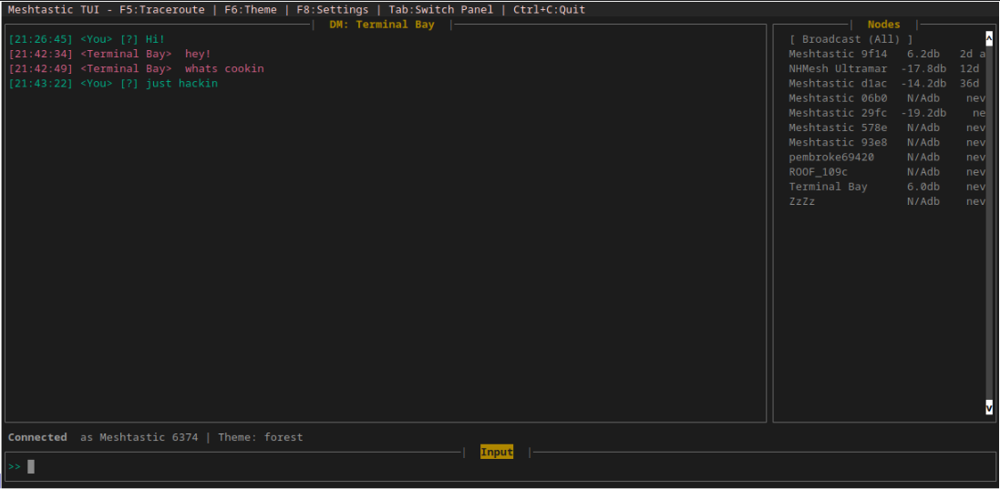

# Meshtastic TUI

A cross-platform terminal user interface (TUI) for Meshtastic radios, written in Python using `prompt_toolkit`.  
Control, chat, and manage nodes on your Meshtastic mesh network. Features dynamic serial port detection, node monitoring, and direct messaging.



---

## Features

- **Real-Time Meshtastic Chat:** Send/receive broadcast and direct (DM) messages.
- **Dynamic Serial Port Selection:** Auto-detect all available serial ports, switch via TUI.
- **Node List Monitoring:** View nodes, SNR, last-heard, and select for DM or traceroute.
- **Message Status:** Shows delivery and error status.
- **Custom Theme/Keybinds:** Color scheme and efficient navigation.

---



# Meshtui Installation Guide

This guide will walk you through the steps to install and run **meshtui**, a terminal user interface for Meshtastic.

---

## Prerequisites

Before you begin, make sure you have the following installed on your system:

* **Python 3.8 or higher:**
  Check your Python version:

  ```bash
  python3 --version
  ```

* **Git:**
  Required to clone the project repository.

---

## Installation Steps

### For Windows Users (Executable)

Simply download the `MeshTUI.exe` from the assets of the release.
Run it directly!

### For Linux and macOS Users (From Source)

If you're on Linux or macOS, you will need to run the application from source. Ensure you have Python 3.x installed, then:

1. **Clone the repository:**

   ```
   git clone [https://github.com/SAMS0N1tE/meshtui.git](https://github.com/SAMS0N1tE/meshtui.git)
   cd meshtui
   
   ```

   (Replace `your-username/your-repo-name` with the actual path to your repository.)

2. **Create and activate a virtual environment (recommended):**

   ```
   python -m venv venv
   # On macOS/Linux:
   source venv/bin/activate
   
   ```

3. **Install dependencies:**

   ```
   pip install -r requirements.txt
   
   ```

4. **Run the application:**

   ```
   python main.py
   
   ```

## Basic Usage

* **`F8`**: Toggle between Chat view and Settings (Port Selection).

* **`Tab`**: Switch between the Input and Nodes panels in Chat view.

* **`Enter`**:

  * In Input panel: Send message.

  * In Nodes panel: Select a node for DM.

  * In Settings panel: Select a port to connect.

* **`Escape`**: Exit DM mode and return to Broadcast chat.

* **`F5` (in Nodes panel)**: Send a traceroute to the selected node. (Broken for now, will work on a fix!)

* **`F6`**: Cycle through available themes.

* **`Ctrl+C` or `Ctrl+Q`**: Quit the application.

## 💡 Feedback & Contributions

This is an initial release, and we welcome your feedback! If you encounter any bugs, have suggestions for new features, or would like to contribute, please open an issue or a pull request on the GitHub repository.


